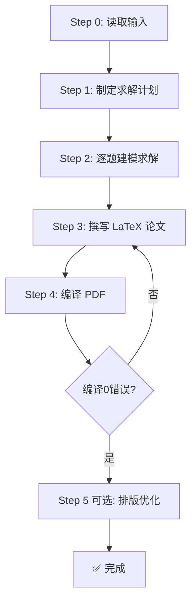

# 数学建模竞赛求解+论文自动生成模板（交流群604148807）

> 🚀 一个 Claude Code Skill —— 读题 → 求解 → 论文 → 编译，全流程自动完成。

[](LICENSE)
[](https://claude.ai/code)

---

## 📖 简介

本项目是一个 **Claude Code 技能（Skill）** 项目模板，专为数学建模竞赛（如国赛、美赛、MathorCup 等）设计。只需将赛题和数据放入对应文件夹，说一句 **"开始求解"**，AI 即可自动完成：

- 📖 **读取赛题**（PDF/DOCX）与附件数据（xlsx/docx）
- 📝 **制定求解计划**，逐问规划方法+输出
- 💻 **编写 Python 代码**逐题求解，自动生成图表
- 📄 **撰写完整论文**（LaTeX），含摘要/建模/检验/评价/参考文献
- 🔧 **编译排版**为 PDF，自动修复 Warning/Error

---

## ✨ 核心特性

- **一键启动** —— 说"开始求解"即可，AI 全自动推进
- **完整流程** —— 覆盖读取→规划→建模→求解→论文→编译的全部环节
- **高质量论文** —— 内置详尽的 LaTeX 规范（摘要≤900字/1页、流程图固定模板、统一 longtable 表格样式等）
- **跨平台中文** —— Python 绘图自动适配 macOS/Windows/Linux 中文字体
- **鲁棒性强** —— 含异常预案、灵敏度分析、交叉验证等学术规范环节
- **模块化论文** —— 每问拆分为 分析与准备 + 建模与求解 两个子文件，便于组织与修改
- **自适应排版** —— 表格自动换页、自动修正编译错误、排版优化循环

---

## 📁 项目结构

```
竞赛模板/
├── CLAUDE.md                    ← Skill 定义文件（AI 行为规范）
├── 题目/                        ← 📥 放入赛题文件（PDF 或 DOCX）
│   └── 题目B：xxx.pdf
├── 数据/                        ← 📥 放入附件数据（xlsx/docx）
│   └── data.csv
├── 求解/                        ← 🤖 AI 自动生成
│   ├── 求解计划.md
│   ├── 预处理数据.csv
│   ├── 问题一/
│   │   ├── 问题一_<描述>.py
│   │   └── figures/
│   ├── 问题二/
│   └── 问题N/
└── 论文/                        ← 🤖 AI 自动生成
    ├── 论文.tex                 ← 主文件
    ├── 论文.pdf                 ← 最终输出
    ├── format.cls               ← 模板样式
    ├── fonts/                   ← 思源宋体
    ├── 0.摘要.tex ~ 4.符号说明.tex
    ├── 5.模型的建立与求解.tex
    ├── 5.X.问题X的建立求解.tex
    ├── 5.X.1.分析与准备.tex
    ├── 5.X.2.建模与求解.tex
    ├── 6.模型检验.tex ~ 8.模型改进推广.tex
    ├── 9.参考文献.tex
    └── 10.附录.tex
```

---

## 🚀 快速开始

### 前置要求

| 依赖 | 用途 | 安装方式 |
|------|------|---------|
| **Claude Code** | AI 执行环境 | [claude.ai/code](https://claude.ai/code) |
| **Python 3.8+** | 求解与绘图 | `pip install pandas numpy matplotlib scipy scikit-learn chardet` |
| **LaTeX (XeLaTeX)** | 论文编译 | macOS: `MacTeX` / Ubuntu: `texlive-xetex` / Windows: `MiKTeX` |

### 三步使用

```bash
# 1. 将此模板复制到新位置
cp -r 竞赛模板/ MyContest2026/

# 2. 放入赛题和数据
#    将赛题 PDF/DOCX 放入 题目/
#    将附件数据 放入 数据/

# 3. 在 Claude Code 中打开该项目，说：
开始求解
```

AI 将自动依次执行：读取输入 → 制定求解计划 → 逐题编写代码求解 → 撰写论文 → 编译 PDF。

---

## 📋 执行流程详解



### Step 0：读取输入
- 解析 `题目/` 下的 PDF/DOCX 文件
- **全量读取** `数据/` 下所有 xlsx/docx，检查数据类型/缺失/合并单元格/隐藏sheet
- 打印数据总览，自动识别问题数量 N

### Step 1：求解计划
生成 `求解/求解计划.md`，六章内容：
1. 题目总体方向
2. 各题求解思路（含方法匹配表）
3. 各题输出标准（图表/表格/数值）
4. 操作步骤（含依赖顺序）
5. 文件清单
6. 异常预案

### Step 2：逐题求解
- 每题一个独立 Python 脚本，中文命名
- **先算后画**：先完成计算→打印统计量→再绘图
- 每题至少 4-6 张图（柱状图/折线图/热力图/散点图等）
- 仅使用 matplotlib + 内置 colormap

### Step 3：撰写论文
- 按规范逐章生成 LaTeX 文件
- 摘要 ≤900字、严格 1 页
- 每问含流程图（固定 9 框 TikZ 模板）+ 算法对比表 + 完整建模推导
- 参考文献 GB/T 7714-2015 格式，8-15 条

### Step 4：编译
```bash
cd 论文
xelatex -interaction=nonstopmode 论文.tex
xelatex -interaction=nonstopmode 论文.tex
```
`grep -c 'Error' 论文.log` 必须为 0。

### Step 5（可选）：排版优化
反复循环：检查 Overflow/Underfull → 修复 → 重编译，直到日志干净。

---

## 📝 论文规范一览

| 章节 | 核心要求 |
|------|---------|
| 摘要 | ≤900字，必须=1页。分"有数据/无数据/建议型"三种模板 |
| 引言 | 2-3段背景 + 问题重述（`\textbf{问题N：}` 格式） |
| 总体分析 | 三段式，逐问串联，不画流程图 |
| 模型假设 | itemize 格式，每条 `\textbf{假设N：}` |
| 符号说明 | 统一 `longtable` 模板，列宽按公式计算 |
| 模型建立与求解 | 每问拆 2 子文件：分析与准备 + 建模与求解 |
| 模型检验 | 误差分析（五折交叉验证）+ 灵敏度分析 |
| 模型评价 | 优点4条 + 缺点2条 |
| 参考文献 | GB/T 7714-2015，8-15条，必须全部在正文引用 |
| 附录 | 附件说明表 |

### 核心规范
- ❌ 正文禁止分点符号（1. 2. 3. 或 ● ○）
- ❌ 禁止正文加粗（`\textbf{}` 仅限摘要和问题重述）
- ❌ 禁止使用 `\newpage` 人为断页
- ✅ 图宽 `0.8\textwidth`，表宽 `\textwidth`
- ✅ 所有表格统一使用 `longtable` 样式
- ✅ 图表标题/caption/坐标轴全中文
- ✅ 表格格子文字一行显示，不换行

---

## 🐍 Python 代码规范

- **只允许 matplotlib**，严禁 seaborn/plotly 等其他可视化库
- **先算后画**：计算全部完成后再绘图
- 每题至少 4-6 张图
- 配色用内置 colormap（viridis, RdBu_r, tab10, Set3）
- 图上不画 `set_title()`，标题由论文 `\caption{}` 承担
- 跨平台中文字体自动适配

```python
# 中文字体配置（跨平台）
plt.rcParams['font.sans-serif'] = ['STHeiti', 'SimHei', 'Heiti TC',
    'Arial Unicode MS', 'Hiragino Sans GB', 'PingFang SC',
    'Microsoft YaHei', 'Songti SC', 'DejaVu Sans']
plt.rcParams['axes.unicode_minus'] = False
```

---

## 🎯 适用场景

- 全国大学生数学建模竞赛（CUMCM）
- 美国大学生数学建模竞赛（MCM/ICM）
- MathorCup 高校数学建模挑战赛
- 研究生数学建模竞赛
- 其他各类数学建模竞赛

覆盖问题类型：优化/预测/分类/评价/机理分析/数据分析/建议总结等。

---

## 📊 示例输出

以下为使用本模板生成的论文效果：

- **摘要**：结构化摘要，含关键词，严格 1 页
- **正文**：每问含分析流程图（TikZ 9 框）+ 算法对比表 + 完整公式推导
- **图表**：统一 matplotlib 风格，中文支持完整
- **排版**：自动换页表格，无溢出，整体紧凑

> 完整示例见 `V2.5【表格自动换页】/论文/论文.pdf`

---

## 🔧 自定义

### 调整论文模板

编辑 `论文/format.cls` 可自定义论文样式（封面/页眉/字体/行距等）。

### 调整 AI 行为

编辑 `CLAUDE.md` 可自定义 AI 的求解策略、论文规范、代码风格等。

### 新增问题类型

在 `CLAUDE.md` 的"各类型中间步骤划分"和"摘要模板"中添加新类型的规范即可。

---

## 📦 版本历史

| 版本 | 更新内容 |
|------|---------|
| **V2.5** | 表格自动换页（longtable）、列宽公式化计算、排版优化循环 |
| V2.0 | 论文模块化拆分、灵敏度分析前置、完整规范体系 |
| V1.0 | 初始版本：读题→求解→论文→编译基础流程 |

---

## 🤝 贡献

欢迎提交 Issue 和 Pull Request！

贡献方向：
- 🐛 报告 Bug 或体验问题
- 📝 改进论文模板或规范
- 🔧 新增问题类型的求解模板
- 🌐 英文本地化

---

## 📄 License

MIT License —— 详见 [LICENSE](LICENSE) 文件。

---

## 👨‍🏫 作者

**阮老师** —— 数学建模指导老师，致力于用 AI 工具提升建模竞赛效率。
**QQ**1834477681
**WX**RZN1111

---

⭐ 如果这个项目对你有帮助，请给一个 Star！
